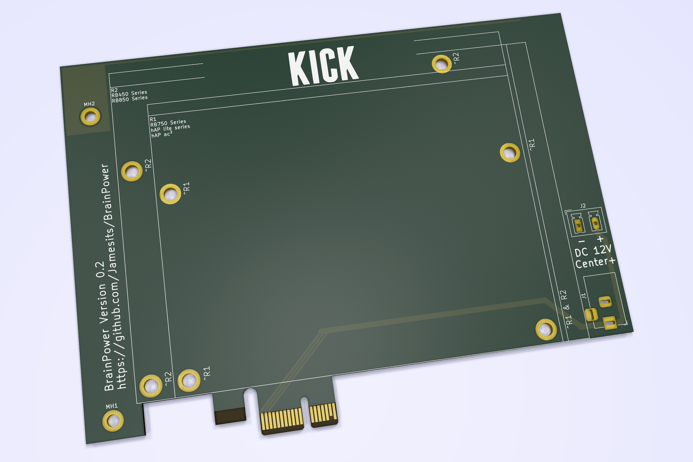

# BrainPower

PCI express x1 (full-height, half-length) socket to 12V DC adapter with MikroTik router mounting holes.

## Shit Advertisement

BrainPower brings the only **hardware-level network redundancy option** on the market for single server deployment as long as your enclosure is large enough. 

BrainPower integrates with your current and future OOB management systems and allows **next-generation SD-WAN** based management network. 

BrainPower adds true **hardware level** NFV functionality for your private cloud (or *servers* as we call it 20 years ago), making it more suitable for **IoT**, **edge computing**, **fog computing** and branch office deployment.

BrainPower enables seamless transition of your legacy network architecture into a more modern, **hybrid** cloud architecture, bringing new possibilities for the smallest number of servers.

## Rendered Graphics

Note: this is a rendered version of BrainPower v0.2 beta (https://github.com/Jamesits/BrainPower/commit/1534756f81d0aac4159775ea0ed6522c7cd4834d) and is subject to change. It does not represent the final product.

## Compatibility

### DC powering options

* 5.5*2.1mm Barrel Jack (compatible with the most common unbranded ones)
* PhoenixContact_MCV_1,5_2-G-5.08_1x02_P5.08mm (intended for wire soldering)

### Mounting hole compatibility

It is compatible with the following MikroTik routers:

**RB750 Series**

* RB750r1/r2/Gr2/Gr3
* RB760iGS
* hAP lite
* hAP AC lite
* hAP AC²

**RB450 Series**

* RB450x2
* RB450Gx2
* RB450Gx4
* RB850Gx2

## Production Guide

### Ordering

For stable releases, you can go to [releases](https://github.com/Jamesits/BrainPower/releases) to download an gerber files archive. Most PCB manufacture sites accept this format.

For development releases, you can use the open-source [KiCAD](http://www.kicad-pcb.org/) to open the project file located in the `BrainPower` sub-folder and plot the gerber files.

### Notes when ordering PCB

* PCB thickness: 1.6mm
* 45° chamfered border for gold fingers

### PCI express I/O Bracket

TBD.
