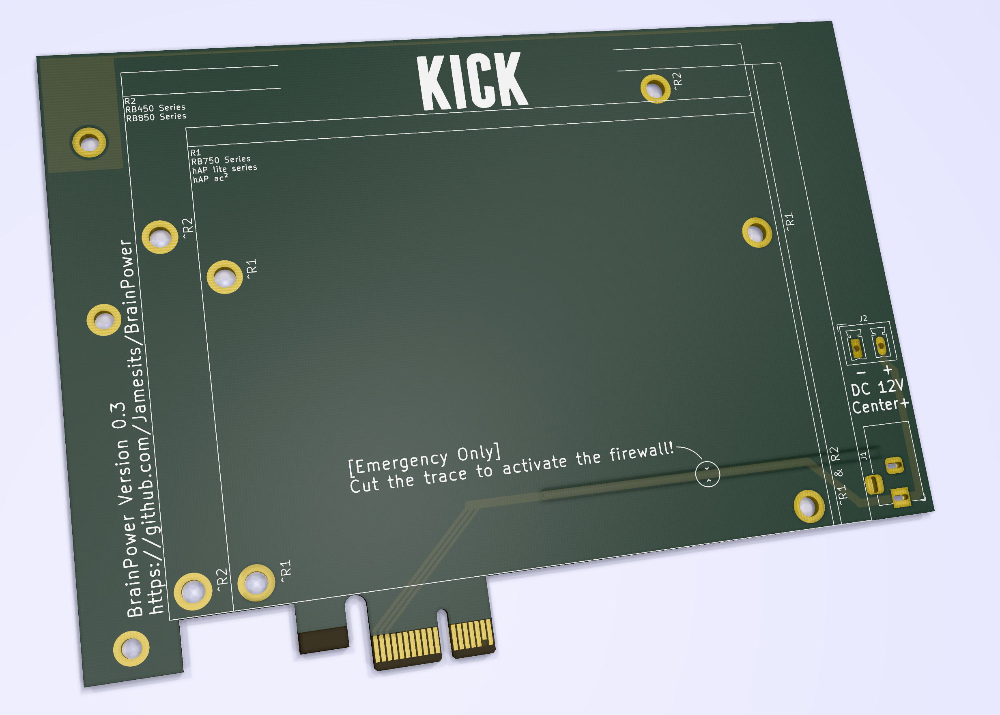

# BrainPower

PCI express x1 (full-height, half-length) socket to 12V DC adapter with specific MikroTik router mounting holes.

## Shit Advertisement

BrainPower adds true **hardware-level NFV functionality** for your ~~servers~~ private cloud, making it more suitable for **IoT**, **edge computing**, **fog computing** and branch office deployment.

BrainPower brings the only **hardware-level network redundancy option** on the market for ~~single server deployment~~ economic hyperconverged solution as long as your enclosure is large enough. 

BrainPower integrates with your current and future OOB management systems and allows **next-generation SD-WAN** based management network. 

BrainPower enables seamless transition of your legacy network architecture into a more modern, **hybrid cloud architecture**, bringing new possibilities for the smallest number of enclosures.

## Rendered Graphics

Note: this is a rendered version of [BrainPower v0.3](https://github.com/Jamesits/BrainPower/commit/e29cd585c712ce8d517ac3b23541380fda902caa) and is subject to change. It does not represent the final product.

For actual photos, see:

* [Version 0.1](https://github.com/Jamesits/BrainPower/wiki/Version-0.1)
* [Version 0.2](https://github.com/Jamesits/BrainPower/wiki/Version-0.2)

## Compatibility

### DC powering options

* 5.5*2.1mm Barrel Jack (compatible with the most common unbranded ones like [this](https://www.adafruit.com/product/373))
* [PHOENIX CONTACT MCV 1,5_2-G-5.08](https://www.phoenixcontact.com/online/portal/us?uri=pxc-oc-itemdetail:pid=1836299&library=usen&tab=1) (intended for wire soldering)

### Mounting hole compatibility

It is compatible with the following MikroTik routers:

**RB750 Series**

* RB750r1/r2/Gr2/Gr3
* RB760iGS
* hAP lite
* hAP AC lite
* hAP AC²

**RB450 Series**

* RB450x2
* RB450Gx2
* RB450Gx4
* RB850Gx2

## Production Guide

### Ordering

For stable or testing releases, you can go to [releases](https://github.com/Jamesits/BrainPower/releases) to download an gerber files archive. Most PCB manufacture sites accept this format.

For development version, you can use the open-source [KiCAD](http://www.kicad-pcb.org/) to open the project file located in the `BrainPower` sub-folder and plot the gerber files.

### Notes when ordering PCB

* PCB thickness: 1.6mm
* 45° chamfered border for gold fingers

### Assembling

Mounting holes for the router are ⌀3.7mm holes, you can use M3 hexagonal column and screws. Mount the router on the B side of the PCB (the side with the "KICK" characters) to comply with PCI express standard; mounting backwards also works with some caveats (reads: we never tested it).

### PCI express I/O Bracket

The PCI express I/O bracket mounting holes are of the same size and position as in *Figure 6-1* and *Figure 6-9*, [*PCI Express® Card Electromechanical Specification Revision 2.0*](https://members.pcisig.com/wg/PCI-SIG/document/download/8285). You can use the brackets from common SAS cards (e.g. LSI SAS9217-8i). 

## Acknowledgement

The PCI express board shape is from [x1 Desktop / Server Rec. Length Card](https://designcontent.live.altium.com/TemplateDesigns/PCI%20Express#TemplateDesignDetail/PDE-0001-00054) and converted with [altium2kicad](https://github.com/thesourcerer8/altium2kicad). Shapes and characters are converted using [svg2shenzhen](https://github.com/badgeek/svg2shenzhen).

The board's name and the fonts came from [NOMA - Brain Power](https://www.youtube.com/watch?v=h-mUGj41hWA) by Martin.

The following people provided assistance and help during the making of this product:

* [Wencey Wang](https://github.com/WenceyWang)
* [LTY](https://github.com/lty1993)
* [Star Brilliant](https://github.com/m13253)
* [Jeremy Wu](https://github.com/jemerywudev)
